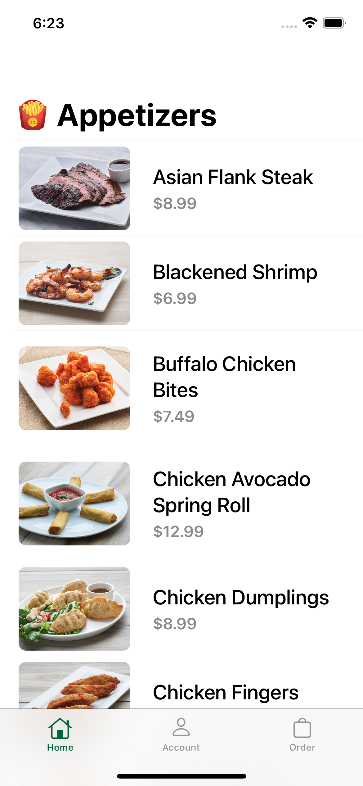

# Appetizer

## Appetizer SwiftUI App (Demo)
### Overview:
Example App based on SwiftUI

### Screenshots
---
### Appetizers
| Screenshot 01 | Screenshot 02 |
| ------------- | ------------- |
|  |  |

### Account
| Screenshot 03 | Screenshot 04 |
| ------------- | ------------- |
|  |  |

### Orders
| Screenshot 05 | Screenshot 06 |
| ------------- | ------------- |
|  |  |
